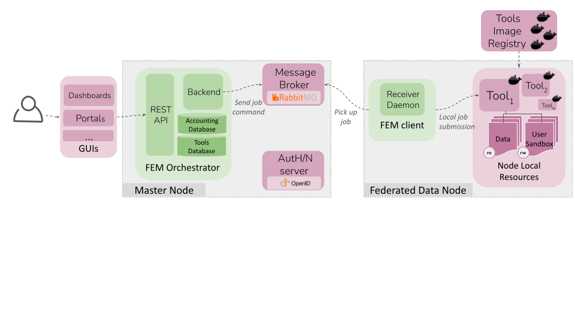

# Federated Execution Manager (FEM) - Client

The Federated Execution Manager (FEM) is a software component designed to coordinate and manage the execution of distributed processes in a federated leaning (FL) or decentralised compute environment where multiple devices or clients, i.e. the federated data nodes (FDN) provide compute and data resources. FEM is responsible for controlling and orchestrating the lifecycle of the federated tasks.
It consists of two parts:
- an **orchestrator module** (FEM-orchestrator) that ensures tasks reach the multiple FDNs in a secure and coordinated manner
- a **client module** (FEM-client) installed at the participating FDN that pulls such tasks and allocates them in the local infrastructure.



In short, the *FEM-client* interact with the FEM-orchestrator via a message broker (RabbitMQ) and pulls the federated task details.   across multiple Federated Data Nodes (FDNs). The FEM Client works in conjunction with the central FEM Orchestrator to manage distributed computing workflows, such as federated learning (FL) experiments and other data processing tasks.

The key functions of the FEM client include:
- **Task reception**: it ensures secure interactions between the FDN and the central orchestrator via a message broker (RabbitMQ) and pulls the federated task details.
- **Task stage-in**: it prepares the working enviroment, handling data volumes, container image pulling and source code Git syncronizations.
- **Task execution**: it executes tasks in the local infraestructure delegating the resources managment the customizable executors or launchers. Default executor: "docker".
- **Task stage-out**: it exchanging the necessary task outfiles and logging files with the central orchestrator.

## Related Repositories
- FEM-orchestrator: https://github.com/DataTools4Heart/FEM-orchestrator
- dt4h-FEM-client-config: https://github.com/DataTools4Heart/dt4h-FEM-client-config

## Prerequisites

##### Minimal technical requirements:
- Unix-based S.O. 
- Docker and Docker Compose
- 2CPUs and 4GB

> Please, consider that tools, pipelines or any task operated by the FEM could add their own tecnical requirements on top of those specified here.

##### Connectivity requirements:
The minimal client connectivity requirements to be part of an FLManager-enabled federation are:
- Outgoing connection to RabbitMQ server
   - Default port: 5671 (AMQPS 1.0 over TLS)
   - Destination: FEM-orchestrator server IP or FQDN 

> Please, consider that tools, pipelines or any task operated by the FEM could add their own connectivity requirements on top of those specified here.

## Getting Started
1. Clone the repository:
```
git clone  https://github.com/DataTools4Heart/FEM-client`
cd FEM-client
```
2. Setup the client for the particular credentials and enpoints of your project 
```
git clone  https://github.com/DataTools4Heart/dt4h-FEM-client-config setup`
cd setup
```
   
## Runnig the client
3. Move to the client folder: `cd client`

4. Rename the `config_template.py` file to config: `mv config/config_template.py config/config.py` and adjust the `config/config.py` with the correct variables

5. Get in touch with the team to receive the SSL certificates. Put in the config folder the unziped rabbitmq-ca folder.

6. Install the required Python packages:
`bash install.sh`

7. Start the RabbitMQ receiver daemon:
`bash start.sh`

8. Monitor the receiver:
`tail -f receiver.log`

## How to
#### Install a new tool

If you are an AI developer and want to run a new model using FEM, follow these steps:

1. **Create a Docker image for your model and share it with the FLManager team.**

2. **Fill in the JSON template for your model:**
   - You can find a tool plan and task template along the schemas in the docs/templates folder so you can fill and provide the necessary details about your tool, including Docker image information or Git repository.

3. **Follow the standard FLManager client setup instructions:**
   `bash install.sh` and `bash start.sh`

4. **Execute the FLManager client:**
   - Start the federated learning process with your model calling the API.

#### Implement a new executor or launcher

Launchers are responsible for setting up and executing tasks based on the provided tool information.

1. **Create a New Launcher Class**
Start by creating a new Python class for your launcher in `launcher.py`. This class should contain methods to construct the command for starting the tool and for actually starting the tool.

2. **Implement the Launcher Logic**
Inside your launcher class, implement the logic for constructing the command to start the tool. This logic may vary depending on the type of launcher you're adding.

3. **Integrate the launcher into the system**
Modify the existing system to integrate your new launcher. This typically involves updating the `run_tool` function to instantiate the appropriate launcher based on the tool's metadata and then calling the `start_tool` method of that launcher.

```
if launcher_type.lower() == "my_new_launcher":
    launcher = MyNewLauncher(tool_info, task_id, execution_id, logger=logger, user_id=user_id)
    response = launcher.start_tool()
    return response
```

4. **Handle errors and logging**
Ensure that your launcher class handles errors gracefully and logs relevant information. This helps with troubleshooting and debugging when things go wrong.

5. **Test**
Before deploying your launcher to production, thoroughly test it to make sure it works as expected. Test various scenarios, including both successful launches and failure cases.


For any issues or inquiries, please contact the FLManager team.


## TODO

- Modelate DB
   - Clean unused fields (hosts.sandbox_root_dir; hosts.sandbox_datapath)


